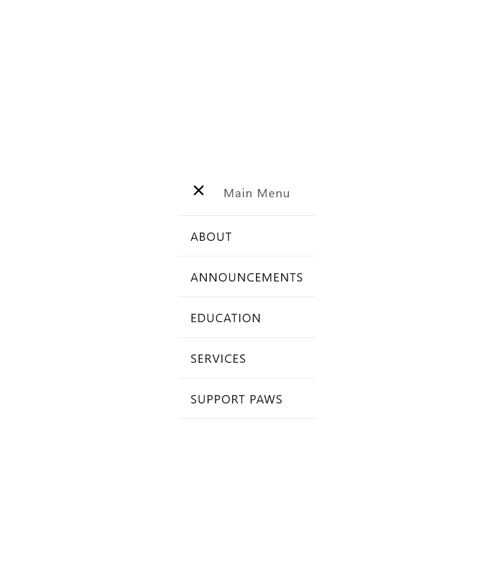
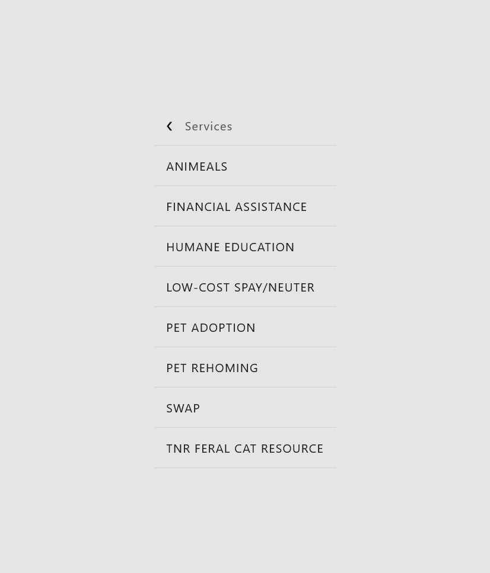

# Responsive Navigation Menu with Mobile Fade Effect

## Table of contents

- [Overview](#overview)
  - [The project](#the-project)
  - [Screenshot](#screenshot)
  - [Links](#links)
- [My process](#my-process)
  - [Built with](#built-with)
  - [What I learned](#what-i-learned)
  - [Continued development](#continued-development)
  - [Useful resources](#useful-resources)
- [Author](#author)

## Overview

### The project

This is a navigation menu I assembled, tweaked and got working from a couple of sources. It has a desktop and mobile/tablet version.

### Screenshot






These are screenshots of the final edit in Firefox.

### Links

- Solution URL: [GitHub Repo](https://github.com/jgiuliano8/Responsive-nav-fade-effect)
- Live Site URL: [Vercel Site](http://responsive-nav-fade-effect.vercel.app/)

## My process

### Built with

- Semantic HTML5 markup
- CSS3
- BEM
- Flexbox
- JavaScript

### What I learned

I wanted to start working on the new navigation for
the PAWS-LI website redesign I have volunteered for.
So I pulled some HTML and CSS code from YouTube for
the dropdown menus and also some code from a Scrimba
course I took for the mobile. The mobile example was
a slide effect which I have in another repository. So
I looked up the fade effect on StackOverflow. Most of
the JavaScript I wrote to get everything to play nice
together and to respond from mobile to desktop and
vice-versa.

I learned a bit about JavaScript and CSS as well as
trying to keep the HTML from using too many divs by
using semantic HTML. I realized I had to not only
add JS event listeners for the mobile menu to work,
but then I also had to clear the event listeners
if the window was resized back to desktop size. So I
needed to learn how to use media queries within
JavaScript.

```javascript
Element.outerHTML = Element.outerHTML;
```

I used the above code to clear all event listeners
from each main menu list-item. The removeEventListener()
method did not seem to work because the event listeners
were anonymous functions. I had to use anonymous
functions because I needed to pass in an argument to
the event listener function.

### Continued development

I would like to better understand capturing and
bubbling in JavaScript. Also I would like to understand
event listeners better.

### Useful resources

- [YouTube DropDown Menu Video](https://www.youtube.com/watch?v=wHFflWvii3M&t=778s)
- [Scrimba](https://scrimba.com/)
- [Stack overflow](https://stackoverflow.com/)
- [MDN](https://developer.mozilla.org/en-US/)

## Author

- Website - [Jeff Giuliano](https://github.com/jgiuliano8)
